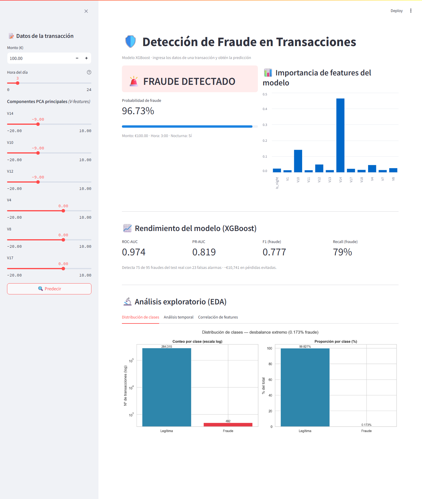

# Credit Card Fraud Detection

> **Detecting financial fraud with Machine Learning — PR-AUC 0.82, ~79% fraud capture**
> *Detección de fraude en transacciones bancarias con clases extremadamente desbalanceadas (0.17%)*

[](https://python.org)
[](https://xgboost.readthedocs.io)
[](https://scikit-learn.org)
[](https://streamlit.io)
[](LICENSE)
[](https://github.com/0marMF/fraud-detection/actions/workflows/ci.yml)

---

## Problema

Las instituciones financieras enfrentan pérdidas millonarias por fraude. El reto principal:
**el 99.83% de las transacciones son legítimas** — construir un modelo que identifique el ~0.17%
fraudulento sin generar demasiadas falsas alarmas es un problema de clasificación con clases
extremadamente desbalanceadas.

---

## Resultados

Modelo seleccionado: **XGBoost** (por PR-AUC), evaluado sobre el test real (sin SMOTE), 56,746 transacciones.

| Métrica | Resultado |
|---|---|
| ROC-AUC | 0.974 |
| PR-AUC | 0.819 |
| PR-AUC (validación cruzada 5-fold) | 0.845 ± 0.034 |
| F1 (fraude, umbral 0.5) | 0.777 |
| Baseline trivial (PR-AUC) | 0.002 |

**Punto de operación recomendado.** El umbral no se deja en 0.5: se elige el que minimiza el
coste en euros — un fraude no detectado cuesta su monto real; una falsa alarma, ~3 € de revisión.

| Umbral | Recall | Fraudes detectados | Falsas alarmas | Coste total |
|---|---|---|---|---|
| 0.5 (por defecto) | 0.79 | 75 / 95 | 23 | ~€4,094 |
| **0.15 (óptimo por coste)** | **0.83** | **79 / 95** | 65 | **~€2,803** |

Bajar el umbral detecta 4 fraudes más y ahorra ~€1,300 netos pese a generar más falsas alarmas.

> Todo es reproducible con un comando: `python -m src.pipeline`. Las cifras se guardan en
> `reports/metrics.json` y cada corrida queda registrada en `reports/experiments.csv`.

---

## Dashboard interactivo

Interfaz en **Streamlit** que carga el modelo XGBoost y predice el riesgo de fraude en vivo a
partir del monto, la hora y los componentes PCA principales:



```bash
streamlit run dashboard/app.py
```

---

## Arquitectura del Proyecto

```
fraud-detection/
│
├── data/
│   ├── creditcard.csv          # Dataset: 284,807 transacciones
│   └── splits.pkl              # Train/test splits procesados
│
├── notebooks/
│   ├── 01_EDA.ipynb            # Análisis exploratorio
│   ├── 02_preprocessing.ipynb  # Limpieza, feature engineering, SMOTE
│   └── 03_modeling.ipynb       # Entrenamiento y evaluación de modelos
│
├── config.yaml                 # Semilla, rutas, hiperparámetros y costes (nada hardcodeado)
│
├── src/                        # La lógica vive aquí; los notebooks la importan
│   ├── data.py  features.py  model.py  evaluate.py
│   ├── pipeline.py             # "python -m src.pipeline" corre todo de una
│   └── best_model.pkl          # Modelo final serializado (XGBoost + umbral por coste)
│
├── dashboard/
│   └── app.py                  # Dashboard interactivo con Streamlit
│
└── reports/                    # Visualizaciones generadas
    ├── 01_class_distribution.png
    ├── 02_amount_analysis.png
    ├── 03_temporal_analysis.png
    ├── 04_feature_correlation.png
    ├── 06_model_comparison.png
    ├── 07_roc_curves.png
    ├── 08_best_model.png
    ├── 09_feature_importance.png
    ├── 10_dashboard.png         # Screenshot del dashboard Streamlit
    ├── 11_threshold_cost.png    # Curva de coste vs umbral
    ├── metrics.json             # Métricas del modelo + punto de operación
    └── experiments.csv          # Registro de cada corrida del pipeline
```

---

## Metodología

### 1. EDA (Exploratory Data Analysis)
- Análisis del desbalance extremo de clases (0.173% fraude)
- Distribución de montos por clase — fraudes tienden a montos bajos o muy altos
- Análisis temporal: patrones de fraude según hora del día
- Correlación de features PCA con la variable objetivo

### 2. Preprocessing & Feature Engineering
```python
# Nuevas features creadas
df['Hour']          = (df['Time'] / 3600) % 24      # Hora del día
df['Amount_log']    = np.log1p(df['Amount'])         # Reduce skewness
df['Is_night']      = (hora >= 22 or hora <= 6)      # Bandera nocturna
df['Amount_scaled'] = RobustScaler().fit_transform() # Normalización robusta
```

### 3. Balanceo de Clases — SMOTE
Las clases desbalanceadas son el mayor reto técnico en detección de fraude.
Se aplicó **SMOTE (Synthetic Minority Over-sampling Technique)** solo sobre el
conjunto de entrenamiento para evitar data leakage.

> Nota: antes del split se eliminaron **1,081 duplicados** detectados en el EDA.

```
Antes SMOTE  → {Legítimas: 226,602 | Fraudes: 378}
Después SMOTE → {Legítimas: 226,602 | Fraudes: 226,602}
```

### 4. Modelos Comparados

| Modelo | ROC-AUC | PR-AUC | F1 | Recall | Por qué |
|---|---|---|---|---|---|
| Logistic Regression | 0.959 | 0.680 | 0.094 | 0.853 | Baseline — alto recall pero precision ínfima |
| Random Forest | 0.939 | 0.817 | 0.830 | 0.768 | Sólido, mejor F1/precision |
| **XGBoost** | **0.974** | **0.819** | 0.777 | 0.789 | Mejor PR-AUC — criterio de selección |

> **¿Por qué PR-AUC y F1, no Accuracy?**
> Accuracy sería 99.8% prediciendo siempre "legítimo". Con 0.17% de positivos, la **PR-AUC**
> (área bajo precision-recall) es la métrica más fiable; XGBoost y Random Forest quedan casi
> empatados y se eligió XGBoost por su PR-AUC marginalmente superior y mayor ROC-AUC.

---

## Cómo ejecutar

```bash
# 1. Clonar el repositorio
git clone https://github.com/0marMF/fraud-detection
cd fraud-detection

# 2. Instalar dependencias
pip install -r requirements.txt

# 3a. Camino rápido: todo el pipeline de una (datos -> features -> modelo -> métricas)
python -m src.pipeline

# 3b. Camino narrado: ejecutar los notebooks en orden (importan de src/)
jupyter nbconvert --to notebook --execute --inplace notebooks/01_EDA.ipynb
jupyter nbconvert --to notebook --execute --inplace notebooks/02_preprocessing.ipynb
jupyter nbconvert --to notebook --execute --inplace notebooks/03_modeling.ipynb

# 4. Lanzar dashboard interactivo
streamlit run dashboard/app.py
```

---

## Stack Tecnológico

- **Python 3.10+** — lenguaje principal
- **Pandas & NumPy** — manipulación de datos
- **Scikit-learn** — preprocessing y métricas
- **Imbalanced-learn** — SMOTE para balanceo de clases
- **XGBoost** — modelo final de clasificación
- **Matplotlib & Seaborn** — visualización estática
- **Plotly & Streamlit** — dashboard interactivo

---

## Lecciones Aprendidas

1. **Accuracy es engañosa en datos desbalanceados** — con 0.17% de fraude, la PR-AUC y el F1 son las métricas que importan
2. **SMOTE solo en train** — aplicarlo en el test set es data leakage y contamina los resultados
3. **La limpieza importa** — el EDA reveló 1,081 duplicados que había que eliminar antes del split
4. **XGBoost y Random Forest quedan casi empatados** — la elección final se justifica con PR-AUC, no con una sola métrica
5. **El impacto de negocio** (pérdidas evitadas) es tan importante como las métricas técnicas

> **Detalle completo de detecciones y aprendizajes en [`HALLAZGOS.md`](HALLAZGOS.md).**

---

## Autor

**Omar Mora Flores**
Data Analyst & ML Engineer
 omar13mor@gmail.com
 [linkedin.com/in/omar-mora-flores](https://linkedin.com/in/omar-mora-flores)

---

## Dataset

Dataset basado en la estructura del [Credit Card Fraud Detection de Kaggle](https://www.kaggle.com/datasets/mlg-ulb/creditcardfraud) — 284,807 transacciones europeas anonimizadas con PCA.

---

*"Los modelos no detectan fraudes. Las personas con buenos modelos, sí."*
